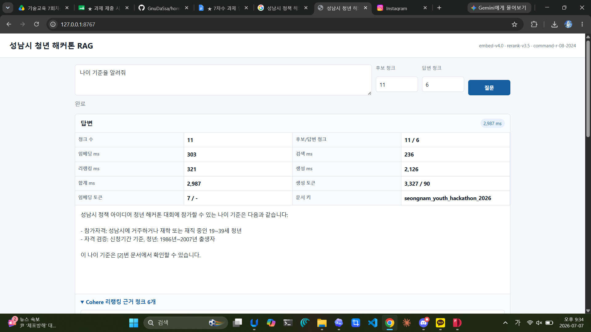
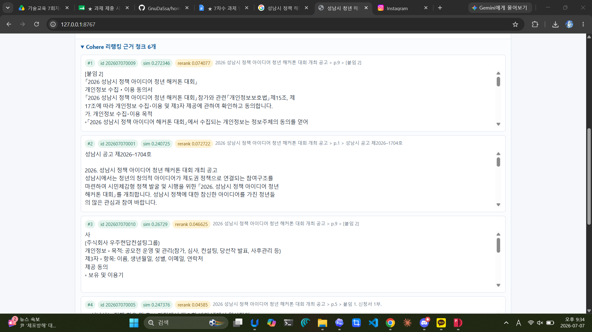
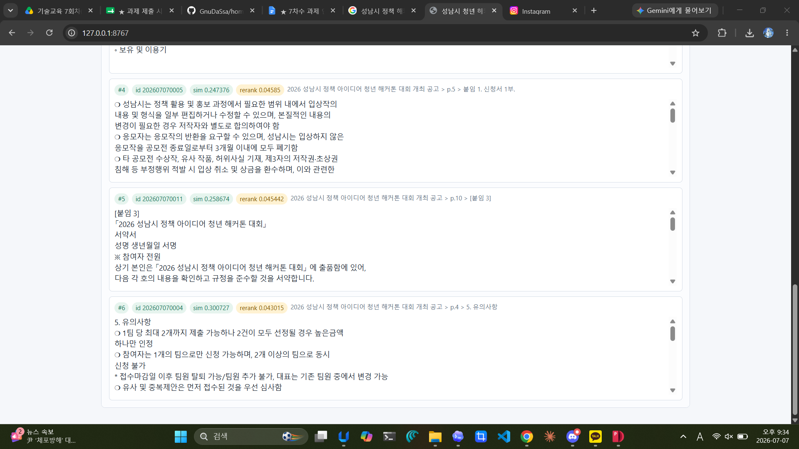

# 성남시 청년 해커톤 RAG

2026 성남시 정책 아이디어 청년 해커톤 공고 PDF를 청킹하고, Supabase `documents_test`에 적재한 뒤 Cohere 기반 RAG 질의응답을 수행하는 예제입니다.

## 구현 배경

초기 구현에서는 OpenAI `text-embedding-3-small` 임베딩을 사용할 계획이었으나, 제공된 OpenAI API 키가 임베딩 요청에서 인증 오류로 동작하지 않았습니다. 따라서 동일한 `vector(1536)` Supabase 스키마를 유지할 수 있도록 Cohere `embed-v4.0`의 1536차원 임베딩을 사용했습니다.

현재 구현은 Cohere trial API 키만으로 임베딩, 리랭킹, 답변 생성을 모두 수행합니다.

## 구성

- `app/chunk_pdf.py`: PDF 텍스트 추출 및 청킹
- `app/cohere_supabase_uploader.py`: Cohere `embed-v4.0` 1536차원 임베딩 생성 후 Supabase 적재
- `app/server.py`: 로컬 RAG API 및 HTML 서버
- `app/index.html`: 질의응답 화면
- `data/hackathon_chunks.json`: 청킹 결과 11개
- `data/hackathon_source.md`: PDF에서 추출한 청킹 전 Markdown 원문
- `결과화면/`: 실행 결과 스크린샷

PDF를 Markdown으로 변환한 기준, 사용한 청킹 기법, 해당 기법을 선택한 이유, 11개 청크가 만들어진 과정은 [docs/chunking.md](docs/chunking.md)에 정리했습니다.

## API 키 관리

API 키와 Supabase service role key는 커밋하지 않습니다.

실행할 때 루트의 `.env.example`을 복사해 `.env`를 만들거나, PowerShell 환경변수로 설정하세요. `.env`는 `.gitignore`에 포함되어 있습니다.

필요한 값:

```powershell
Copy-Item .env.example .env
# .env 파일을 열어 SUPABASE_URL / SUPABASE_SERVICE_ROLE_KEY / COHERE_API_KEY 값을 채우세요.
```

## 설치

```powershell
cd app
pip install -r requirements.txt
```

## 청킹

```powershell
python .\chunk_pdf.py --input "C:\path\to\2026 성남시 정책 아이디어 청년 해커톤 대회 개최 공고.pdf" --output ..\data\hackathon_chunks.json
```

현재 저장소에는 이미 생성된 `data/hackathon_chunks.json`이 포함되어 있습니다.

## Supabase 적재

`documents_test` 테이블은 아래 컬럼을 사용합니다.

- `id`
- `content`
- `metadata`
- `embedding vector(1536)`

적재:

```powershell
python .\cohere_supabase_uploader.py --table documents_test --input ..\data\hackathon_chunks.json
```

이번 문서의 청크는 `metadata.document_key = seongnam_youth_hackathon_2026`로 필터링됩니다.

현재 Supabase `documents_test`는 기존 테스트 데이터를 삭제한 뒤, 이 저장소의 `data/hackathon_chunks.json`에서 생성한 해커톤 공고 청크 11개만 적재한 상태를 기준으로 동작합니다. 앱의 `DOCUMENT_KEY` 기본값도 `seongnam_youth_hackathon_2026`로 맞춰져 있어, 화면의 답변과 근거 청크는 이 테이블에 적재된 데이터와 직접 연계됩니다.

## 실행

```powershell
python .\server.py
```

브라우저에서 엽니다.

```text
http://127.0.0.1:8767
```

## RAG 흐름

```text
질문
-> Cohere embed-v4.0, search_query, 1536차원
-> Supabase documents_test에서 document_key 기준 검색
-> Cohere rerank-v3.5
-> Cohere command-r-08-2024 답변 생성
```

## 결과화면






